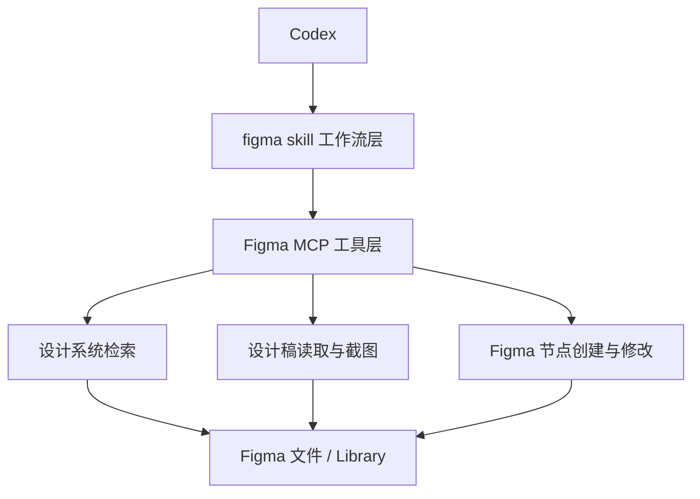

# Codex的SDD开发实践

> **写在前面**
>
> 这是这篇文章中最“古法”的部分——手工编写的部分。余下的内容都是由AI基于我的项目实践以及我补充的背景信息生成的。
>
> 如果你觉着阅读起来有些不那么好理解，最好的办法是把这篇文章喂给你的AI让它来学习和总结给你。
>
> 感谢AI，让我又有功夫和内容写技术博客了🤡
>

## 1. 为什么要用 SDD

### 1.1 SDD 是什么

SDD 是 `Spec-Driven Development` 的缩写，可以理解为“以规格为中心驱动设计、实现与验证的开发方式”。它不是“先写一堆文档再开发”，而是把需求、设计、实现、验证放进同一个可追踪的闭环里，让每一步都有明确输入和输出。

如果只用自然语言聊需求，常见问题通常有三类：

- 需求描述很像共识，但真正开始实现时，大家对边界条件的理解并不一致。
- UI/UX 设计看起来已经成型，但没有被显式绑定到实现约束，最终落地时容易偏。
- 代码写完以后，只验证“能不能跑”，却没有系统检查“是不是按需求和设计跑”。

SDD 的价值就在于把这些隐性信息显性化，让 Codex 不只是“帮你写代码”，而是“帮你维护一个从规格到实现再到验证的连续上下文”。

### 1.2 需要先统一的几个术语

| 术语 | 解释 | 在闭环中的作用 |
| --- | --- | --- |
| `SDD` | 以规格为中心驱动需求、设计、实现和验证的开发方式 | 整体方法论 |
| `OpenSpec` | 用于管理 change、spec、design、tasks 等产物的工作流与工具集 | 规格流转骨架 |
| `Change` | 一次相对独立的需求变更单元 | 闭环的工作容器 |
| `Spec` | 描述系统应满足的能力和场景 | 回答“系统必须做到什么” |
| `Design` | 解释关键设计决策、约束和权衡 | 回答“为什么这样做” |
| `Tasks` | 将设计拆解为可执行任务 | 回答“具体怎么落地” |
| `Figma MCP` | Codex 连接 Figma 文件、设计系统和节点操作能力的工具层 | 回答“如何真正读写 Figma” |
| `Figma skill` | Codex 调用 Figma 能力时遵循的技能约束与流程 | 把设计系统和 UI 约束显式化 |
| `验证闭环` | 对任务完成度、需求覆盖、实现一致性和设计偏差进行系统核对 | 回答“是否真的完成” |

### 1.3 为什么 Codex 适合做 SDD

Codex 的优势不是单点能力，而是“跨阶段连续工作”：

- 能先帮你澄清需求，再生成 OpenSpec 产物。
- 能把 Spec 继续转成 Figma 里的 UI/UX 方案，而不是让设计和实现断开。
- 能沿着 Tasks 落地代码，并在实现后反向验证是否符合规格。

因此，Codex 在 SDD 场景里的最佳用法不是“一次性问一个问题”，而是让它承担一条完整工作链上的协作者角色。

## 2. Codex 闭环能力地图

下面这张图可以把 Codex 在 SDD 场景中的职责串起来：


这条链路里有两个关键认识：

- `OpenSpec` 负责把“为什么做、做什么、如何拆解”沉淀成结构化产物。
- `Figma` 相关 skill 负责把“UI/UX 应该长什么样、遵守什么设计系统规则”沉淀成可执行设计约束。

换句话说，OpenSpec 让需求不漂，Figma 让设计不飘，最终 `openspec-apply-change` 和 `openspec-verify-change` 让实现不跑偏。

### 2.1 Figma MCP 在闭环里的位置

如果只提 `figma-create-design-system-rules`、`figma-generate-design` 和 `figma-use`，读者很容易误以为这些是“直接操作 Figma 的全部能力”。实际工作时，真正连接 Codex 和 Figma 文件的是 `Figma MCP`。

可以把它理解成两层：

- `Figma MCP` 是工具层，负责提供可调用的 Figma 能力。
- `figma skill` 是工作流层，负责告诉 Codex 应该按什么顺序、用什么约束去调用这些能力。

关系可以简化成下面这样：



这层区分非常重要，因为它解释了为什么“会用 skill”还不够。

- 没有 `Figma MCP`，Codex 无法真正读取设计系统、截图、节点结构或写回 Figma。
- 没有 `figma skill`，Codex 虽然能调工具，但容易用错顺序，或者跳过设计系统约束，最后退化成“在 Figma 里随手拼图”。

在实际闭环中，两者通常这样配合：

| 层级 | 负责什么 | 典型能力 |
| --- | --- | --- |
| `figma skill` | 规定流程、约束和最佳实践 | `figma-create-design-system-rules`、`figma-generate-design`、`figma-use` |
| `Figma MCP` | 提供可执行的 Figma 工具能力 | `search_design_system`、`get_design_context`、`get_screenshot`、`use_figma` |

因此，第二阶段更准确的说法其实不是“用 Figma 设计一下”，而是“通过 Figma MCP 把设计系统、界面结构和设计结果变成 Codex 可以持续引用和验证的上下文”。

## 3. 示例设定

为了避免把教程写成具体项目复盘，下面统一使用一个独立示例贯穿全文。

### 3.1 示例背景

我们有一个“习惯打卡”小程序，其中“今日打卡页”是高频入口页。当前页面存在三个问题：

- 用户进入页面后，无法在首屏快速确认“今天是否已完成打卡”。
- 连续打卡趋势和激励信息埋得太深，用户需要额外滚动才能看到。
- 主操作按钮不够突出，导致“立即打卡”路径不够直接。

### 3.2 目标

- 让用户在首屏 3 秒内确认今日状态。
- 让连续打卡趋势成为首屏核心信息之一。
- 让主操作入口在视觉上更聚焦、更容易点击。

### 3.3 非目标

- 不重做整个小程序的导航结构。
- 不修改后端打卡数据模型。
- 不在本次变更中加入新的社交玩法。

### 3.4 验收标准

- 首屏必须同时出现“今日状态”“连续打卡趋势”“主操作入口”三类关键信息。
- 页面在未打卡、已打卡、连续打卡中断三种状态下都应有明确反馈。
- UI 方案进入 Figma 后，设计系统 token 和组件复用策略必须明确。
- 代码实现完成后，能够用 `openspec-verify-change` 明确说明哪些需求已覆盖、哪些风险已收口。

后文所有 OpenSpec、Figma 和实现验证动作，都围绕这个示例展开。

## 4. 阶段一：把模糊需求变成 OpenSpec 产物

### 4.1 这一阶段要解决什么问题

这一阶段的目标不是“立刻开工”，而是把一句模糊需求变成一组可以持续传递上下文的规格产物。

如果你直接让 Codex 实现“把今日打卡页做得更好”，它很可能会：

- 自己补全一些你没有明确确认过的产品假设。
- 在没有边界定义的情况下直接做 UI 决策。
- 把功能改动和视觉改动混在一起，导致后续验证很难对齐。

因此，第一阶段要先把下面四类信息写清楚：

- 为什么改
- 改哪些能力
- 为什么这样设计
- 具体怎么拆成任务

### 4.2 推荐使用的 skill

- `openspec-explore`：先把模糊需求拆开，澄清目标、边界、风险和成功标准。
- `openspec-new-change`：创建一个新的 change 容器。
- `openspec-continue-change`：根据当前 workflow 状态，逐步补齐 `proposal`、`spec`、`design`、`tasks`。

推荐顺序：

1. 先用 `openspec-explore` 把问题空间聊清楚。
2. 再用 `openspec-new-change` 建立变更容器。
3. 再在后续多轮对话里反复调用 `openspec-continue-change`，逐步把 artifact 补齐。

这里有一个实践上很重要的点：

- `proposal`、`spec`、`design`、`tasks` 通常不是在一轮对话里一次性补完。
- 更常见的是先创建 change，确认第一份 artifact 的方向，再在后续几轮里逐步补 proposal、design、spec、tasks。
- 中间如果发现方向要调整，也往往是在某一轮里只改一个 artifact，而不是整套重写。

所以，真实协作节奏通常更像“创建 -> 看状态 -> 产出一个 artifact -> 确认 -> 继续”，而不是“一轮把整个 change 全部生成完”。

### 4.3 可直接复用的提示词示例

结合真实使用习惯，这一段通常会更像“自然语言提需求 + 指定当前要推进到哪一步”，而不是预先把字段全部写满。

更常见的做法是：

- 第一轮把需求背景和推进意图一起交代清楚
- Codex 先帮你建好 change、总结当前状态、给出第一份 artifact 的说明
- 后面很多时候只需要一句“继续”，就让 `openspec` 流程往下推进
- 如果中间你补充了新约束，也往往只需要针对当前 artifact 追加一句说明

所以，比起“教科书式大段说明”，下面这种写法更接近日常协作。

```md
Openspec New Change
我想改一下“今日打卡页”。目标是让用户一进来就能看清今天有没有打卡、连续打卡趋势和主操作入口，先不要写实现，先按 openspec 起一个 change，并停在第一份 artifact 说明这一步。
```

```md
继续，先把 proposal 起出来。
```

```md
继续，下一步该到哪个 artifact 就补哪个。
先别急着实现，先把这一轮该确认的内容写实。
```

如果你在第一轮里愿意多给一点背景，也可以是这种风格：

```md
Openspec New Change
我想把“今日打卡页”做一次改版。现在的问题是首屏状态不够明确，连续打卡趋势也不够突出，主操作入口不够聚焦。暂时不动导航和后端，先帮我走 openspec，把 proposal 这一步准备好。
```

如果进入中间轮次，提示词通常会更短，像这样：

```md
继续，把 design 补出来，重点看信息层级和状态切换。
```

```md
继续，这一轮把 specs 补齐，先覆盖核心 capability 和关键场景。
```

```md
继续，把 tasks 拆到可以直接开做的程度。
```

这类 prompt 的关键不是一次把所有字段都说完，而是让 Codex 明确下面几件事：

- 当前讨论的是哪个需求
- 现在要推进到哪个阶段
- 这一阶段你最关心什么

剩下的 Why、Capabilities、Scenarios、Tasks，通常可以交给 `openspec` 工作流继续反推和补齐。

换句话说，真实协作里更常见的不是“我先把 proposal 结构完整写给你”，而是：

1. 先用一句自然语言把需求讲清楚。
2. 明确告诉 Codex 现在推进到哪一步。
3. 让 Codex 先返回 change 状态、artifact 顺序和下一步模板。
4. 然后你再在后续多轮对话里，用一句“继续”或一句补充说明把流程推下去。

### 4.4 这一阶段的产出应该长什么样

这一阶段结束后，至少应得到四类最小产物骨架。

#### `proposal.md` 最小骨架

```md
## Why

- 当前体验问题是什么
- 为什么现在值得改

## What Changes

- 本次变更会调整哪些能力
- 哪些部分明确不改

## Capabilities

### New Capabilities

- 如果有新增能力，写在这里

### Modified Capabilities

- 如果是改造现有能力，写在这里

## Impact

- 会影响哪些页面、组件或服务类型
- 是否影响接口、数据结构或验证逻辑
```

#### `specs/<capability>/spec.md` 最小骨架

```md
## ADDED Requirements

### Requirement: 首页需要突出今日打卡状态

系统必须在首屏明确展示用户今日是否完成打卡。

#### Scenario: 用户今天尚未打卡

- **WHEN** 用户进入今日打卡页
- **THEN** 页面应展示未完成状态
- **AND** 主操作按钮应引导用户立即打卡

#### Scenario: 用户今天已打卡

- **WHEN** 用户进入今日打卡页
- **THEN** 页面应展示已完成状态
- **AND** 页面应显示已完成后的反馈信息
```

#### `design.md` 最小骨架

```md
## Context

- 当前页面结构的主要问题
- 本次改版涉及的约束

## Goals / Non-Goals

- 本次设计要解决什么
- 明确不做什么

## Decisions

### 1. 首屏采用三段式信息结构

- 决策
- 原因
- 影响

### 2. 主操作按钮固定为视觉焦点

- 决策
- 原因
- 影响

## Risks / Trade-offs

- 可能风险
- 取舍说明
```

#### `tasks.md` 最小骨架

```md
## 1. 页面结构重构

- [ ] 1.1 调整首屏信息层级
- [ ] 1.2 收敛今日状态卡和趋势区结构
- [ ] 1.3 突出主操作入口

## 2. 状态与边界态补齐

- [ ] 2.1 补齐未打卡态
- [ ] 2.2 补齐已打卡态
- [ ] 2.3 补齐连续打卡中断态

## 3. 验证与收尾

- [ ] 3.1 自检 spec 覆盖情况
- [ ] 3.2 验证主要用户路径
- [ ] 3.3 更新归档前说明
```

如果这些产物能稳定回答“为什么做、做什么、怎么做、如何验收”，就说明第一阶段已经建立了 SDD 的基础骨架。

## 5. 阶段二：把 Spec 变成 UI/UX 方案

### 5.1 这一阶段要解决什么问题

很多团队在第一阶段做完以后，仍然会在第二阶段失速。原因通常不是不会画页面，而是设计约束没有被结构化表达。

常见问题有：

- 规格里写了“主操作要突出”，但没有约束到视觉优先级和组件策略。
- 页面进入 Figma 后只是在“画图”，没有先声明设计系统规则。
- UI 方案和实现之间没有统一中介，导致设计稿看起来合理，落地时却变成大量硬编码。

因此，这一阶段真正要解决的是：把 Spec 中的用户目标、信息层级和边界条件，转成可复用、可约束、可落地的 UI/UX 方案。

### 5.2 这一阶段为什么要显式使用 Figma MCP

在 SDD 闭环里，Figma 不只是一个出图工具，而是需求规格进入视觉层后的结构化工作台。之所以要显式强调 `Figma MCP`，是因为它让第二阶段具备了三个普通设计沟通方式很难做到的能力：

#### 1. 让设计系统可检索

如果没有 MCP，Codex 只能根据描述“猜”应该复用哪些按钮、卡片、颜色和间距规则。有了 MCP 之后，Codex 可以真正检索设计系统中的：

- 组件
- 变量和 token
- 文本样式和效果样式

这会直接减少“看着像同一种组件，结果实现时新建了另一套”的问题。

#### 2. 让设计稿可读取和可验证

Figma MCP 不只是写入能力，还包括读取能力。它可以帮助 Codex：

- 读取页面结构和节点信息
- 获取设计稿截图
- 检查生成后的页面是否符合预期层级

这意味着 Figma 不再只是人工主观确认，而是可以进入“设计可验证”的链路。

#### 3. 让设计结果能被实现阶段持续引用

第二阶段最怕的是设计结果停留在“看图说话”。有了 Figma MCP 之后，Codex 可以把设计结果继续传递给实现阶段：

- 哪些区块是独立结构
- 哪些元素应该复用设计系统组件
- 哪些属性差异应该通过 variant、token 或样式表达

这会让“Spec -> Figma -> Code”之间的映射关系更稳定。

### 5.3 推荐使用的 skill

- `figma-create-design-system-rules`：先定义设计系统规则，让 Codex 知道在 Figma 到代码的过程中什么能复用、什么不能硬编码。
- `figma-generate-design`：基于页面目标和结构拆段生成页面骨架与关键区块。
- `figma-use`：对 Figma 文件进行精修、校验、调整结构和节点属性。

推荐顺序：

1. 先用 `figma-create-design-system-rules` 补齐规则。
2. 再用 `figma-generate-design` 构建页面骨架。
3. 最后用 `figma-use` 做精修和校验。

这里有一个非常重要的实践原则：先定义“怎么设计”，再定义“长什么样”。

### 5.4 Figma MCP 的典型能力分工

为了避免把 Figma 阶段理解成一个黑箱，可以把常用能力再拆成三类：

#### 1. 设计系统检索类

适合回答“应该复用什么”：

- `search_design_system`
- `figma-create-design-system-rules`

这一类能力的重点不是画图，而是先决定：

- 组件从哪里来
- token 从哪里来
- 哪些视觉差异允许存在

#### 2. 设计读取与校验类

适合回答“当前设计长什么样、有没有偏”：

- `get_design_context`
- `get_screenshot`
- `get_metadata`

这一类能力的意义在于把 Figma 从“主观审美产物”变成“可检查上下文”。

#### 3. 设计生成与精修类

适合回答“怎么把结构写进 Figma 文件”：

- `figma-generate-design`
- `figma-use`
- `use_figma`

这一类能力的重点不是一次性做完整页，而是按区块逐步生成、逐步验证、逐步修正。

你可以把第二阶段理解为这样一条最小链路：

1. 先用设计系统检索能力确定复用边界。
2. 再用设计生成能力搭出页面骨架。
3. 再用读取和截图能力做校验。
4. 最后用精修能力修正偏差。

### 5.5 可直接复用的提示词示例

```md
请基于 Figma MCP 能力，先使用 figma-create-design-system-rules，帮我为一个“习惯打卡小程序”的页面改版建立设计系统规则。

背景：
- 目标页面是“今日打卡页”
- 我希望后续 Figma 到代码的过程尽量复用设计系统
- 不希望在页面实现里硬编码颜色、间距和按钮样式

请输出适合 Codex 使用的规则思路，重点覆盖：
1. 组件复用策略
2. 设计 token 使用原则
3. 页面骨架与区块拆分原则
4. Figma 到代码的约束方式
```

```md
请基于 Figma MCP，为“今日打卡页改版”生成 UI/UX 方案。

要求：
- 先检索设计系统中可复用的组件、token 和样式
- 再按区块拆段生成页面骨架
- 生成过程中持续保留后续实现可复用的信息

页面目标：
- 首屏快速确认今日状态
- 清晰展示连续打卡趋势
- 主操作按钮成为视觉焦点

约束：
- 先按照区块拆段构建页面，不要一次性堆完整页
- 优先复用设计系统组件和 token
- 不要通过硬编码视觉值来凑效果

请先给出页面区块拆分建议，再进入页面设计。
```

```md
请使用 figma-use，并结合 Figma MCP 的读取和截图能力，对已经生成的“今日打卡页”设计稿进行精修。

请重点检查：
1. 首屏三类关键信息是否同时成立
2. 主操作按钮是否具有最强视觉优先级
3. 未打卡、已打卡、连续中断三种状态是否有明确反馈
4. 颜色、间距、圆角、文本层级是否都遵守设计系统规则
```

### 5.6 这一阶段的产出应该长什么样

这一阶段的结果不应该只是“一张看起来不错的页面”，而应该是下面四类信息都已经清晰：

#### 1. 页面骨架清晰

以“今日打卡页”为例，可以先拆成三个核心区块：

- 顶部状态区：今日是否完成、简短反馈、日期语义
- 趋势区：连续打卡天数、近一周趋势、激励信息
- 主操作区：立即打卡或查看详情

这样的拆法能直接映射回 Spec 中的验收标准，而不是只追求视觉漂亮。

#### 2. 设计系统规则先于视觉细节

一个成熟的 Figma 方案至少要明确：

- 哪些 UI 元素应该复用已有组件
- 哪些颜色和间距必须来自 token
- 哪些文本层级应该通过样式或组件属性表达
- 哪些差异应该用 variant，而不是复制新组件

如果从 Figma MCP 视角看，这一步最好还能补齐两类“可追踪证据”：

- 设计系统检索结果已经说明页面依赖哪些组件、变量和样式。
- 设计稿读取结果已经能解释页面区块、节点结构和关键视觉反馈。

#### 3. 设计结果能反向约束实现

如果设计稿最终只能告诉开发“照着抄”，那它并没有真正进入 SDD 闭环。

真正有效的设计结果应该能反向约束实现，例如：

- 主操作必须是一个语义明确、可复用的主按钮变体。
- 三种页面状态必须映射到明确的视觉反馈模式。
- 趋势区的信息优先级必须和 Spec 中定义的关键路径一致。

#### 4. 设计和 Spec 的映射关系明确

你可以用下面这种简单对照方式自检：

| Spec 目标 | Figma 体现 |
| --- | --- |
| 首屏可确认今日状态 | 顶部状态区首屏可见，文案与状态标识明确 |
| 连续打卡趋势要突出 | 趋势区位于主操作区上方，拥有明确视觉层级 |
| 主操作入口必须聚焦 | 页面主按钮颜色、尺寸和留白都明显高于次级元素 |

如果 Figma 产出可以稳定对应回 Spec 的目标，这一阶段就完成了“从规格到设计”的闭环衔接。

如果再进一步，Figma MCP 还能让你补上第二层判断：

- 这份设计是否真的复用了设计系统，而不是重新拼了一套视觉语言。
- 这份设计是否已经为实现阶段保留了足够清晰的结构化上下文。

## 6. 阶段三：把设计落成代码并验证

### 6.1 这一阶段要解决什么问题

这是最容易被误解的一步。很多人以为“实现”就是把设计稿翻译成页面代码，但在 SDD 里，实现阶段要同时回答两个问题：

- 代码是否按 `tasks.md` 的拆解顺序逐步落地
- 结果是否仍然符合 `spec` 和 `design` 的约束

如果只关注开发速度，就容易出现这几类偏差：

- 任务已经打勾，但场景覆盖并不完整。
- 页面看起来接近设计稿，但关键交互没有满足 Spec 的场景要求。
- 代码写完以后没有验证一致性，最后只能靠人工回忆“应该差不多”。

更贴近真实开发的节奏，通常不是“先一次性实现完，再统一验收”，而是下面这种循环：

1. 先按 `tasks.md` 做一轮实现。
2. 你自己在本地、真机或开发者工具里试一轮。
3. 把发现的问题直接反馈给 Codex。
4. Codex 继续在同一条 change 上补一轮。
5. 关键问题收敛后，再用 `openspec-verify-change` 判断是否具备归档条件。

所以，这一阶段真正要解决的不是“如何一口气做完”，而是“如何在实现、试用、修正、验收之间稳定循环”。

### 6.2 推荐使用的 skill

- `openspec-apply-change`：沿着 `tasks.md` 实施代码改动，并持续更新任务状态。
- `openspec-verify-change`：检查完成度、正确性和一致性。
- `openspec-sync-specs`：如果 change 中的 delta specs 需要同步回主规格，可以在实现完成后执行。
- `openspec-archive-change`：当实现与验证都闭环后，归档这次 change。

更真实的使用顺序通常是：

1. 用 `openspec-apply-change` 进入第一轮实现。
2. 你在本地、真机或开发者工具里试一轮。
3. 把新问题直接反馈给 Codex，再继续用 `openspec-apply-change` 收口。
4. 问题收得差不多后，用 `openspec-verify-change` 做闭环校验。
5. 需要时执行 `openspec-sync-specs`。
6. 最后再用 `openspec-archive-change` 收尾。

也就是说，`openspec-apply-change` 往往不是只调用一次，而是会穿插在多轮实现和问题修正里反复使用；`openspec-verify-change` 则更像一个“是否可以收尾”的关卡，而不是每一轮都先跑的动作。

### 6.3 可直接复用的提示词示例

实现阶段的 prompt，真实使用里通常也不会写成完整任务说明，而更像下面几类：

- 指定 change，直接开第一轮实现
- 补一条新的实现上下文
- 试完以后反馈一组具体问题
- 明确说“先别归档，再补一轮”

```md
Openspec Apply today-checkin-page-refresh
先开始做实现，按 tasks 往下推。实现时持续对着 spec 和 design 来，不要只改页面样式。
```

```md
Openspec Apply today-checkin-page-refresh
主操作按钮用现有主按钮组件，文案就叫“立即打卡”。如果资源文件我已经放好了，你直接按合适命名接进去。
```

```md
Openspec Apply today-checkin-page-refresh
我已经把一部分资源准备好了，趋势区先按现有卡片体系接，状态区放在最上面，主操作放在它下面。
```

```md
Openspec Apply today-checkin-page-refresh
我这边试了一轮，现在有几个问题：
1. 首屏状态反馈还是不够明确
2. 趋势区视觉层级偏弱
3. 已打卡态和未打卡态切换时文案不够清晰

你先按这些问题继续收一轮，不用重做方案，直接在现有 change 上修。
```

```md
Openspec Apply today-checkin-page-refresh
这一轮只先收口体验问题：
1. 页面尽量更干净
2. 主操作再突出一点
3. 把一个次级信息块拿掉
```

```md
我在开发者工具里又试了一轮，还有几个验收问题：
1. 主操作有点抢过头了，导致趋势区被压住
2. 已打卡态反馈够明显，但未打卡态还是有点弱
3. 有一个次级提示应该去掉常驻

你继续在这条 change 上收一轮，先别归档。
```

```md
请使用 openspec-verify-change，验证“今日打卡页改版”这条 change 现在是否已经可以归档。
重点帮我看：
1. tasks 是否已经完整覆盖并正确标记
2. spec 中的 requirement 和 scenario 是否都有实现证据
3. design 中的信息层级和状态反馈是否被遵守
4. 还有哪些问题会阻碍归档
```

```md
如果 verify 结果已经没明显阻塞了，就继续用 openspec-sync-specs 和 openspec-archive-change 收尾。
最后给我一个简洁结论：哪些已闭环，哪些是后续优化项。
```

### 6.4 这一阶段的产出应该长什么样

一个完成度较高的实现阶段，通常会留下四类证据：

#### 1. `tasks.md` 已经从计划清单变成执行记录

理想状态不是“任务全打勾”，而是“每个勾选都能对应到实现变化”。这意味着：

- 任务拆得足够明确
- 实现过程没有跳步
- 最终验证时能顺着任务反查实现

#### 2. 多轮试用和问题修正都有痕迹

真实开发里，一条 change 往往不是“写完就结束”，而是会经历多轮：

- 做一轮
- 试一轮
- 提问题
- 再修一轮

如果这部分过程完全没有痕迹，最后就很难解释为什么某些实现决策被保留、某些体验问题被修掉。

#### 3. `verify` 结果能够说明是否具备归档条件

`openspec-verify-change` 最有价值的地方，是它不会只告诉你“看起来没问题”，而是会从三个维度做检查：

- `Completeness`：任务和规格项是否完整覆盖
- `Correctness`：实现是否真的满足 requirement 和 scenario
- `Coherence`：实现是否遵守 design 中的关键决策

#### 4. 验证闭环清单明确

下面这份清单可以直接作为通用的验收模板：

```md
## 验收清单模板

### 完成度

- [ ] `tasks.md` 中的任务都已处理，并且状态准确
- [ ] 关键任务存在明确实现证据
- [ ] 未完成项已经被显式记录，而不是被忽略

### 正确性

- [ ] 每个核心 requirement 都能找到实现映射
- [ ] 每个关键 scenario 都有行为支撑
- [ ] 主用户路径已经被实际验证

### 一致性

- [ ] 实现遵守 `design.md` 中的核心决策
- [ ] UI 层级与状态反馈和 Figma 方案一致
- [ ] 没有为了赶进度引入明显违背设计系统的硬编码

### 归档判断

- [ ] 当前 change 已具备归档条件
- [ ] 若暂不归档，剩余问题已经被列为明确阻塞项
```

当这三类证据都完整时，SDD 才算真正走完闭环，而不是只完成了“设计稿到页面代码”的那一小段。

## 7. 最佳实践与常见误区

### 7.1 推荐的实践顺序

如果你希望 Codex 真正成为 SDD 协作者，而不是零散工具，建议默认按下面的思路工作：

1. 先澄清需求，再创建 change。
2. 先写规格，再进入设计。
3. 先定义设计系统规则，再生成页面方案。
4. 先按 tasks 实现，再做 verify。
5. 确认闭环成立后，再同步规格和归档。

这个顺序的核心不是形式感，而是避免在高成本阶段做低质量决策。

### 7.2 什么场景适合走完整 SDD

适合走完整闭环的典型场景有：

- 需求本身有多方理解差异，容易反复返工。
- 变更同时涉及产品目标、UI/UX 和实现细节。
- 页面状态较多，边界条件复杂。
- 团队希望把这次改动沉淀为可复用方法，而不是一次性修补。

### 7.3 什么场景可以走轻量流程

不是所有任务都需要完整 SDD。下面这些情况通常适合轻量流程：

- 纯文案调整
- 明确的小样式修复
- 不涉及交互语义变化的视觉微调
- 已有规格非常清晰，只需要做小范围实现

轻量流程不等于放弃规范，而是用更短的链路完成低风险变更。

### 7.4 四个常见误区

#### 误区一：把 SDD 理解成“先写文档”

真正的 SDD 不是把开发前置成文档劳动，而是用规格来降低后续设计和实现的不确定性。

#### 误区二：把 Figma 当作纯视觉产物

如果 Figma 方案没有绑定组件复用、token 使用和状态差异，它就仍然只是图片，而不是设计约束。

#### 误区三：实现阶段只看设计稿，不看 Spec

设计稿可以告诉你页面应该如何呈现，但只有 Spec 才能告诉你系统必须满足哪些场景和能力。

#### 误区四：验证阶段只跑测试，不核对一致性

测试能证明“系统能运行”，但不能自动证明“实现符合原始目标”。`openspec-verify-change` 的意义正是在这里。

### 7.5 一套可长期复用的心法

如果要把这篇教程压缩成一句话，那就是：

> 先让需求成为规格，再让规格成为设计，再让设计约束实现，最后用验证把整条链路闭合。

当你用 Codex 这样工作时，它就不再只是一个代码生成器，而是一个能贯穿需求设计、UI/UX 设计、代码实现与验证的 SDD 协作伙伴。
